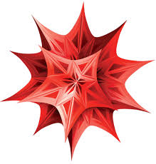

## Quantum Computing Architectures and Algorithms (PHYS731)
 New Uzbekistan University, Spring semester 2026
{: .centered}

### Course material
- [check your understanding ](/skripta/PHYS731_probs.md)

### Supplements
1) "Pedestrian" demonstration of a 2-level decomposition of a 4-dimensional Unitary
challenge: Produce a function which generalizes this <a href="/data/two-level_decomposition.nb">.nb</a> implementation.

2)  [code](/data/bloch_sphere_rotation.py) to approximate a general 1-Qbit Unitary (specified in [rotation_params.yaml](/data/rotation_params.yaml)) as a sequence of phase and Hadamard gates.

## Three lectures on the decomposition of the A-body Green function
 International Centre for Theoretical Sciences at TIFR (Bengaluru), Jan 2026
 
- <a href="https://icts.res.in/program/satpp2026/talks"> Complete program including lecture recordings</a>
- [preliminary lecture notes ](/skripta/ICTS_2026.pdf)
- [list of references ](/skripta/ICTS_26_jkirscher_reading-list.pdf)
- [diagrammatic summary ](/skripta/wein_circle.pdf)

## Advanced Quantum Mechanics New Uzbekistan University, Aug - Dec 2025
 
- [lecture notes ](/skripta/syllabus_QM2.pdf)

## An hour on (nuclear) effective (field) theories
  Conference on Cosmology, Astrophysics, and Particle Physics, SRMIST, Feb 1 (2025)
{: .centered}

- <a href="CCAPP_joki.html"> Lecture slides</a>
- <a href="https://www.sciencedirect.com/science/article/abs/pii/S0370157306000822"> Review on systems linked elegantly via EFTs</a>

## The E&M field and quantized oscillators
  A 15m path to renormalization and the Casimir force
{: .centered}

- [Presentation slides ](/skripta/NUU_170125_joki_HO.pdf)
- <a href="/data/HO_wave-functions.nb">.nb - Harmonic-oscillator spectrum</a>
- <a href="/data/Casimir.nb">.nb - Casimir visualization</a>

## Beschleuniger und Synchrotronstrahlungsquellen FAU Erlangen, WS 2004
{: .centered}

- [Vorlesungsskript ](/skripta/accel_skript.pdf)
- [Presentation ](/skripta/accel_pres.pdf)

## Engineering Physics SRM University AP, Aug - Dec 2024
{: .centered}

<ul>
<li> Klicker-quiz questions:&emsp;
Z-section (<strong>Course PIN: 416 049 891</strong>) -- <a href="https://pwa.klicker.uzh.ch/course/f172190f-4c31-46da-a526-221572432c2d/join?pin=416049891">url</a> -- <a href="/data/QR-Z.png">QR</a>
</li>
<li> Lecture notes
	<ul style="list-style-type:disc"> <li> Mechanics
		<ul style="list-style-type:circle"> 
		 <li><a href="unit1-1.html">Vectors</a> -- <a href="/data/unit_1_1-groups.pdf">working groups CSE-<strong>Z</strong></a></li>
		 <li>Laws of motion I: <a href="unit1-2.html">kinematics</a> -- <a href="/data/unit_1_2-groups.pdf">working groups CSE-<strong>Z</strong></a></li>
		 <li>Laws of motion II: <a href="unit1-3.html">dynamics</a> (incl. interactive  experiment)</li>
		 <li>Laws of motion III: <a href="unit1-4.html">types of forces</a></li>
		 <li>Conservation laws: <a href="unit1-5.html">momentum and energy</a></li>
		</ul>
		</li>
		<li> Optics
			<ul style="list-style-type:circle">
				<li><a href="unit2-1.html">Waves</a></li>
					<ul style="list-style-type:square">
						<li><a href="https://phet.colorado.edu/sims/html/wave-interference/latest/wave-interference_all.html">Virtual wave-interference laboratory</a></li>
						<li><a href="/data/waves.nb">.nb - An introduction using organs</a></li>
						<li><a href="/data/interference_double-slit.nb">.nb - Interference with identical and different frequencies</a></li>
						<li><a href="/data/Huygens.nb">.nb - Huygens principle</a></li>
					</ul>
			</ul>
		</li>
		<li> Electromagnetism
			<ul style="list-style-type:circle">
				<li><a href="/data/balloons-and-static-electricity_en.html">Virtual charge separation</a></li>
				<li><a href="/data/Gauss_law.pdf">Coulomb's and Gau&#223;' law (electrostatic)</a></li>
			</ul>
		</li>
	</ul>
</li>
<li> Course material
	<ul style="list-style-type:disc">
<li> <a href="https://en.wikipedia.org/wiki/Demarcation_problem">The <i>Abgrenzungsproblem</i></a> (<a href="https://en.wikipedia.org/wiki/The_Logic_of_Scientific_Discovery">primary source</a>)</li>
<li> <a href="https://www.feynmanlectures.caltech.edu/">The Feynman lectures</a></li>
<li> <a href="/data/FIC_102_UNIT-I.pdf">Skriptum used by the other sections</a></li>
<li> <a href="https://davidmorin.physics.fas.harvard.edu/books/problems-mechanics/">Challenging (when not asking an "<i>assistant</i>" to do them for you) problems</a></li>
<li><a href="https://www.wolframcloud.com/">.nb cloud/online reader</a></li>
</ul>
</li>
</ul>